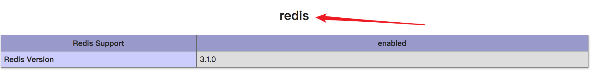

环境
- CentOs 7
- php5.6
- redis3.1

## 1.下载redis的php扩展包到指定目录
``` shell
wget https://github.com/phpredis/phpredis/archive/3.1.0.tar.gz
```
## 2.解压压缩包，进入解压目录，找到phpize指令并执行。生成configure文件
```shell
tar -zxf  3.1.0.tar.gz
cd phpredis-3.1.0/
/usr/local/php/bin/phpize
```
完成之后会在phpredis-3.1.0/中生成configure
## 3.执行configure指令，并指定php-config的位置
```shell
./configure  --with-php-config=/usr/local/php/bin/php-config
```
## 4 .编译和安装
```shell
make && make install
```
成功后会生成的动态库redis.so,路径为：
`/usr/local/php/lib/php/extensions/no-debug-non-zts-20131226/redis.so`

## 5 .修改php.ini配置文件，加上redis扩展库
```shell
vim  /path/php.ini   #path改为自己路径，添加以下行
extension=/usr/local/php/lib/php/extensions/no-debug-non-zts-20131226/redis.so
```

重启服务器，使用命令`php -m |grep redis `进行查看，有了redis说明成功。 或者新建php文件，使用phpinfo函数查看有redis选项即可,如下：


